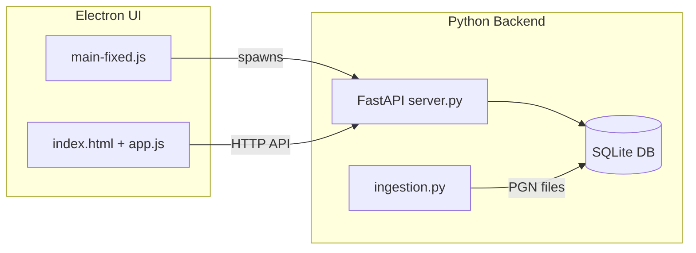
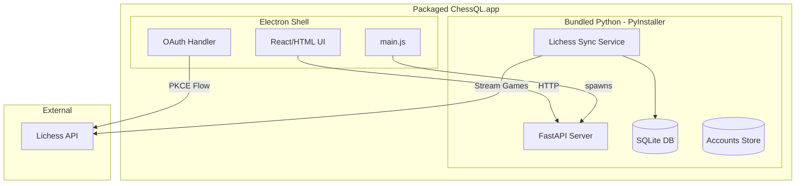

# ChessQL Desktop Application Packaging Plan

**Overview**: Transform ChessQL into a packaged desktop application with Lichess OAuth authentication, game streaming/sync, multi-account support, and cross-platform distribution starting with macOS.

## Todos

- [ ] Implement Lichess OAuth2 PKCE authentication flow
- [ ] Add accounts table and management to database.py
- [ ] Create Lichess game streaming/sync service
- [ ] Add sync API endpoints to server.py
- [ ] Build account management UI components
- [ ] Configure PyInstaller for Python backend bundling
- [ ] Configure electron-builder for macOS packaging
- [ ] Create unified build scripts for the full app

---

## Current Architecture



## Target Architecture



---

## Phase 1: Lichess Authentication

**Goal**: Implement OAuth2 PKCE flow for secure Lichess authentication.

### Backend Changes (server.py)

- Add new endpoints:
  - `POST /auth/lichess/start` - Generate PKCE code verifier and return auth URL
  - `POST /auth/lichess/callback` - Exchange auth code for tokens
  - `GET /auth/accounts` - List all linked accounts
  - `DELETE /auth/accounts/{username}` - Remove an account

### New Files

- `lichess_auth.py` - OAuth2 PKCE flow implementation
- `accounts.py` - Account management (store tokens, usernames)

### Database Schema Addition

```sql
CREATE TABLE accounts (
    id INTEGER PRIMARY KEY,
    username TEXT UNIQUE NOT NULL,
    access_token TEXT NOT NULL,
    token_expires_at INTEGER,
    created_at TIMESTAMP DEFAULT CURRENT_TIMESTAMP,
    last_sync_at TIMESTAMP,
    games_count INTEGER DEFAULT 0
);
```

### Lichess App Registration

- Register app at https://lichess.org/account/oauth/app
- Callback URL: `chessql://oauth/callback` (custom protocol) or `http://localhost:PORT/callback`

---

## Phase 2: Lichess Game Streaming

**Goal**: Stream and sync games from Lichess API into local SQLite database.

### New Module: `lichess_sync.py`

- Use Lichess API: `GET /api/games/user/{username}`
- Support streaming NDJSON format for efficiency
- Parse games and convert to internal format
- Track `last_sync_at` for incremental updates

### Sync Strategy

1. **Initial sync**: Download all games (can be slow for active accounts)
2. **Incremental sync**: Use `since` parameter with Unix timestamp of last game
3. **Background sync**: Optional periodic sync while app is open

### API Endpoints

- `POST /sync/start/{username}` - Start sync for an account
- `GET /sync/status/{username}` - Get sync progress
- `POST /sync/stop/{username}` - Cancel ongoing sync

---

## Phase 3: Account Management

**Goal**: Allow users to manage multiple Lichess accounts.

### Backend

- Modify database.py to support account-scoped queries
- Add `account_id` foreign key to games table
- Update queries to filter by account when needed

### UI Components

- Account management panel (add/remove accounts)
- Account selector in main UI
- Sync status indicators
- Per-account game counts and stats

---

## Phase 4: Application Packaging

**Goal**: Bundle everything into a distributable macOS application.

### Python Backend (PyInstaller)

Create `chessql.spec` for PyInstaller:

```python
# Bundle server.py and all dependencies into single executable
a = Analysis(['start_server.py'],
             pathex=['.'],
             binaries=[],
             datas=[],
             hiddenimports=['uvicorn.logging', 'uvicorn.protocols.http'],
             ...)
exe = EXE(pyz, a.scripts, ...)
```

Output: `dist/chessql-server` (standalone executable ~80-150MB)

### Electron Updates (main-fixed.js)

```javascript
// Instead of spawning python3 server.py
const serverPath = app.isPackaged 
  ? path.join(process.resourcesPath, 'chessql-server')
  : path.join(__dirname, '..', 'chessql', 'server.py');

chessqlServer = spawn(
  app.isPackaged ? serverPath : 'python3',
  app.isPackaged ? [] : ['server.py'],
  { cwd: app.isPackaged ? undefined : chessqlPath }
);
```

### electron-builder Configuration

Add to `package.json`:

```json
{
  "build": {
    "appId": "com.chessql.desktop",
    "productName": "ChessQL",
    "mac": {
      "category": "public.app-category.utilities",
      "target": ["dmg", "zip"],
      "icon": "assets/icon.icns"
    },
    "extraResources": [
      {
        "from": "../chessql/dist/chessql-server",
        "to": "chessql-server"
      }
    ],
    "protocols": {
      "name": "ChessQL",
      "schemes": ["chessql"]
    }
  }
}
```

### Build Process

```bash
# 1. Build Python backend
cd chessql && pyinstaller --onefile start_server.py -n chessql-server

# 2. Build Electron app
cd chessql-ui && npm run build
```

---

## Phase 5: Additional Considerations

### Security

- Store OAuth tokens using `electron-store` with encryption
- Never expose tokens to renderer process
- Use secure IPC for auth flows

### Data Location

- Use `app.getPath('userData')` for SQLite database
- Portable data: `~/Library/Application Support/ChessQL/` on macOS

### Rate Limiting

- Lichess API: 15 requests/second for authenticated users
- Implement request throttling in sync service

### Error Handling

- Network failure recovery
- Token expiration and refresh
- Graceful degradation for offline mode

### Future Cross-Platform (Windows/Linux)

- PyInstaller works cross-platform
- electron-builder supports Windows (NSIS) and Linux (AppImage)
- Main changes: icon formats, installer scripts

---

## Recommended Implementation Order

| Phase | Effort | Dependencies |
|-------|--------|--------------|
| 1. Lichess Auth | 2-3 days | None |
| 2. Game Streaming | 2-3 days | Phase 1 |
| 3. Account Management | 1-2 days | Phase 1, 2 |
| 4. Packaging | 2-3 days | All above |
| 5. Polish and Testing | 2-3 days | All above |

**Total Estimate**: 10-14 days

---

## Additional Features to Consider

1. **Auto-updates** - Use electron-updater for seamless updates
2. **Game import from other platforms** - Chess.com, Chess24
3. **Cloud backup** - Optional sync to user's cloud storage
4. **Opening explorer** - Analyze opening repertoire from synced games
5. **Crash reporting** - Sentry or similar for debugging production issues

